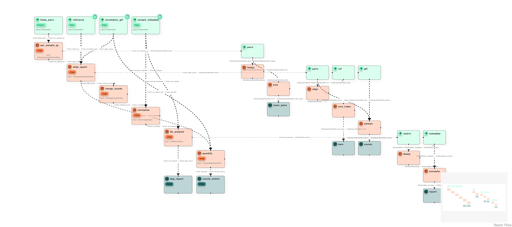

# Theseus-cwl

A React based toolkit for working with [CWL (Common Workflow Language)](https://www.commonwl.org/) workflows through visual and code-based interfaces.

[](https://www.npmjs.com/package/@theseus-cwl/ui-react-viewer)
[](https://www.npmjs.com/package/@theseus-cwl/ui-react-editor)
[](https://www.npmjs.com/package/@theseus-cwl/types)

<div align="center">
  
</div>

## ✨ Features

### @theseus-cwl/ui-react-viewer



- 🔍 Visualize CWL workflows as interactive graphs
- 📂 Flexible API: Supports JSON, YAML, or parsed objects
- Can be used as a standalone package

### @theseus-cwl/ui-react-editor


- 📝 Edit CWL definitions as structured code
- 📂 Flexible API: Supports JSON, YAML, or parsed objects
- Can be used as a standalone package

## 🚀 Installation

```bash
npm install @theseus-cwl/ui-react-viewer @theseus-cwl/ui-react-editor @theseus-cwl/types
# or
yarn add @theseus-cwl/ui-react-viewer @theseus-cwl/ui-react-editor @theseus-cwl/types
```

## 🛠 Example Usage

The CwlViewer component accepts CWL data in three forms:

- JSON object (parsed CWL, as in the example below)

- File

- String (raw JSON or YAML string)

```tsx
import { CwlSource } from "@theseus-cwl/types";
import { CwlViewer } from "@theseus-cwl/ui-react-viewer";

const Example = () => {
  const source: CwlSource = {
    entrypoint: "main",
    documents: [
      {
        name: "main",
        content: {
          cwlVersion: "v1.2",
          class: "Workflow",
          label: "Theseus CWL",
          inputs: {
            message: "string",
          },
          outputs: {
            output: {
              type: "File",
              outputSource: "echo_step/output",
            },
          },
          steps: {
            echo_step: {
              run: {
                class: "CommandLineTool",
                baseCommand: "echo",
                inputs: {
                  message: {
                    type: "string",
                    inputBinding: {
                      position: 1,
                    },
                  },
                },
                outputs: {
                  output: {
                    type: "File",
                    outputBinding: {
                      glob: "output.txt",
                    },
                  },
                },
                stdout: "output.txt",
              },
              in: {
                message: "message",
              },
              out: ["output"],
            },
          },
        },
      },
    ],
    inputs: [
      {
        name: "input",
        content: {
          message: "Hello from Theseus CWL !",
        },
      },
    ],
  };

  return <CwlViewer input={source} />;
};
```

Theseus accepts valid CWL JSON/YAML objects and renders an editable graph that reflects the current state of the workflow.

## 📦 Monorepo Structure

This repository includes:

### Apps

- `test`: Testing application
- `landing-page`: The project landing page

### Packages

- [@theseus-cwl/ui-react-viewer](./packages/ui) React graph viewer for CWL
- [@theseus-cwl/ui-react-editor](./packages/ui-react-editor) React code editor for CWL
- [@theseus-cwl/types](./packages/types) CWL object type definitions

### Internal packages

- [@theseus-cwl/configurations](./packages/configurations)
- [@theseus-cwl/typescript-config](./packages/typescript-config)
- [@theseus-cwl/eslint-config](./packages/eslint-config)

## Local Development

See:

docs/local-development/run-theseus-cwl.md

## 📘 Learn More about CWL

- [Common Workflow Language (CWL)](https://www.commonwl.org/)

## 📣 Contributing

We welcome contributions! If you'd like to improve Theseus or suggest new features.

## 📄 License

MIT License © 2026 [Davide Giorgiutti]
