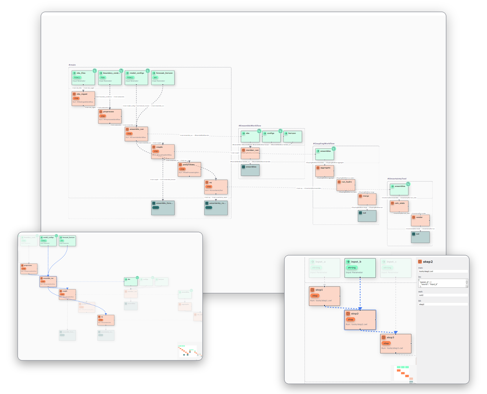
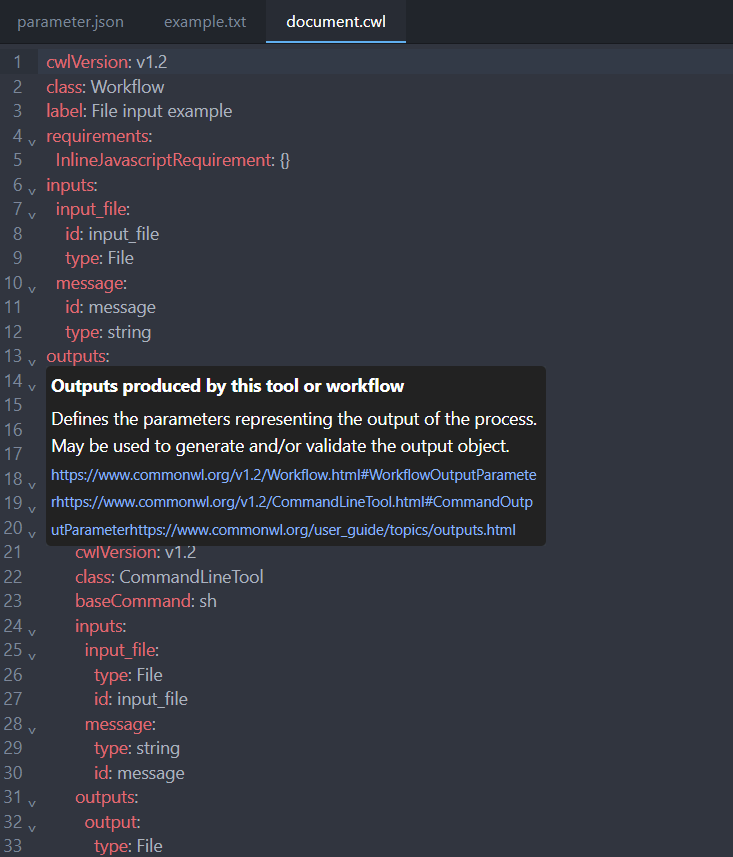
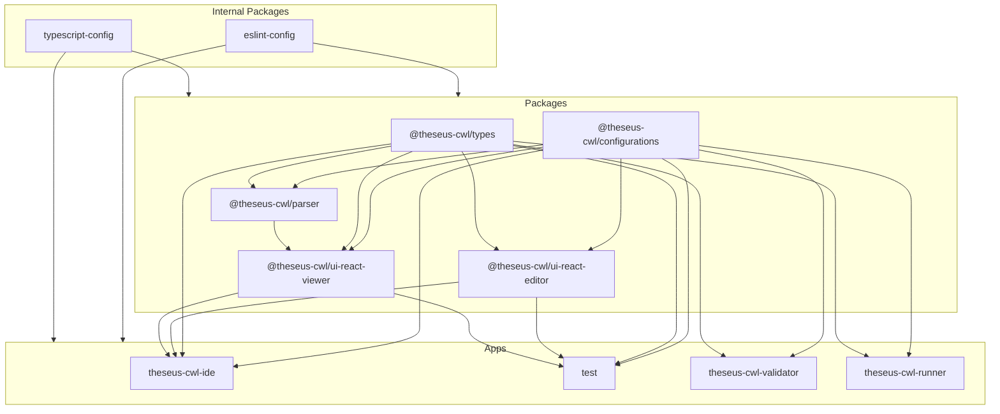

# Theseus-cwl

A React based toolkit for working with [CWL (Common Workflow Language)](https://www.commonwl.org/) workflows through visual and code-based interfaces.

[](https://www.npmjs.com/package/@theseus-cwl/ui-react-viewer)
[](https://www.npmjs.com/package/@theseus-cwl/ui-react-editor)
[](https://www.npmjs.com/package/@theseus-cwl/parser)
[](https://www.npmjs.com/package/@theseus-cwl/types)
[](https://www.npmjs.com/package/@theseus-cwl/configurations)

<div align="center">
  
</div>

## ✨ Features

### @theseus-cwl/ui-react-viewer

<p align="center">
  
</p>
<p align="center">
  <em>A packed <code>$graph</code> document rendered as a graph, hover &amp; selection highlighting, and the node inspector.</em>
</p>

- 🔍 Renders any CWL file as an interactive DAG graph - steps are topologically sorted, packed `$graph` documents show the main workflow and its subworkflows side by side
- 🔦 Hover & selection highlighting, a node inspector panel, and optional minimap, edge labels, and wrapper boxes
- 📂 Flexible input - accepts a parsed CWL object, a raw JSON/YAML string, or a `File`
- 🎨 Fully themeable via `--cwl-viewer-*` CSS variables and runtime color configuration
- 📦 Standalone - a single React component with React as the only peer dependency

See the full API and styling docs in [packages/ui-react-viewer](./packages/ui-react-viewer).

### @theseus-cwl/ui-react-editor

<p align="center">
  
</p>

- 📝 Multi-file editing with tabs - every document and parameter of a `CwlSource` becomes a tab, shown in a CodeMirror editor with YAML syntax highlighting
- 💡 CWL-aware editing - keyword autocompletion and hover documentation for CWL documents
- ✏️ Edits flow back as a `CwlSource` - changes are emitted (debounced) as an updated source
- 🎨 Fully themeable via `--cwl-code-editor-*` CSS variables
- 📦 Standalone - a single React component with React as the only peer dependency

See the full API and styling docs in [packages/ui-react-editor](./packages/ui-react-editor).

## 🚀 Installation

```bash
npm install @theseus-cwl/ui-react-viewer @theseus-cwl/ui-react-editor @theseus-cwl/types
# or
yarn add @theseus-cwl/ui-react-viewer @theseus-cwl/ui-react-editor @theseus-cwl/types
```

## 🛠 Example Usage

Both components consume the same `CwlSource` - a set of CWL documents plus input parameter files. Document content is accepted in three forms:

- JSON object (parsed CWL, as in the example below)

- File

- String (raw JSON or YAML string)

The components fill their parent element, so make sure to render them inside an explicitly sized container - an unsized parent results in an empty view.

```tsx
import { CwlSource, Shape } from "@theseus-cwl/types";
import { CwlViewer } from "@theseus-cwl/ui-react-viewer";

const Example = () => {
  const source: CwlSource<Shape.Raw> = {
    entrypoint: "main.cwl",
    documents: [
      {
        name: "main.cwl",
        content: {
          cwlVersion: "v1.2",
          class: "Workflow",
          label: "Theseus CWL",
          inputs: {
            message: "string",
          },
          outputs: {
            output: {
              type: "File",
              outputSource: "echo_step/output",
            },
          },
          steps: {
            echo_step: {
              run: {
                class: "CommandLineTool",
                baseCommand: "echo",
                inputs: {
                  message: {
                    type: "string",
                    inputBinding: {
                      position: 1,
                    },
                  },
                },
                outputs: {
                  output: {
                    type: "File",
                    outputBinding: {
                      glob: "output.txt",
                    },
                  },
                },
                stdout: "output.txt",
              },
              in: {
                message: "message",
              },
              out: ["output"],
            },
          },
        },
      },
    ],
    parameters: [
      {
        name: "input.json",
        content: `{ "message": "Hello from Theseus CWL !" }`,
      },
    ],
  };

  return (
    <div style={{ height: "600px" }}>
      <CwlViewer input={source} />
    </div>
  );
};
```

The same `source` can be passed to `CwlCodeEditor` from `@theseus-cwl/ui-react-editor` to edit it as code - see each package's README for the full API.

## 📦 Monorepo Structure

This is an npm-workspaces + [Turborepo](https://turborepo.com/) monorepo. It ships the published `@theseus-cwl/*` libraries, the shared tooling they build on, and a set of apps that consume them. Releases are versioned and published with [Changesets](https://github.com/changesets/changesets).

### Packages

| Package                                                    | Description                                                                                                                                 | Depends on                                       |
| ---------------------------------------------------------- | ------------------------------------------------------------------------------------------------------------------------------------------- | ------------------------------------------------ |
| [@theseus-cwl/types](./packages/types)                     | CWL v1.2 TypeScript type definitions and the `CwlSource` input model - the shared vocabulary of the whole toolkit                           | —                                                |
| [@theseus-cwl/parser](./packages/parser)                   | Parses and normalizes raw CWL (JSON/YAML/`File`/string/object) into typed, sanitized objects (`CWLSourceHolder`) - the shared parsing layer | `types`                                          |
| [@theseus-cwl/configurations](./packages/configurations)   | Shared runtime configuration constants (node sizes/colors, timings, CWL keywords), overridable at startup via `configureTheseusCwl`         | —                                                |
| [@theseus-cwl/ui-react-viewer](./packages/ui-react-viewer) | `CwlViewer` React component - renders CWL workflows as interactive DAG graphs                                                               | `parser`, `configurations`, `types` (types only) |
| [@theseus-cwl/ui-react-editor](./packages/ui-react-editor) | `CwlCodeEditor` React component - tabbed CodeMirror editor for CWL source files                                                             | `types`, `configurations`                        |

### Tooling packages

Development-only shared configuration, used by every package and frontend app:

- [@theseus-cwl/eslint-config](./packages/eslint-config) - shared ESLint flat configs
- [@theseus-cwl/typescript-config](./packages/typescript-config) - shared `tsconfig` bases

### Apps

All apps are leaves of the dependency graph - nothing imports them.

| App                                                   | Description                                                                                                                                        | Uses                                                                                                    |
| ----------------------------------------------------- | -------------------------------------------------------------------------------------------------------------------------------------------------- | ------------------------------------------------------------------------------------------------------- |
| [theseus-cwl-ide](./apps/theseus-cwl-ide)             | Browser IDE (Vite/React): edit, visualize, validate and run CWL workflows. Combines the editor and viewer, and calls the two backends. Dockerized. | `ui-react-editor`, `ui-react-viewer`, `parser`, `types`, `configurations`; HTTP → `validator`, `runner` |
| [theseus-cwl-validator](./apps/theseus-cwl-validator) | Express backend that validates CWL documents via `cwltool --validate`. Dockerized.                                                                 | `types` (types only)                                                                                    |
| [theseus-cwl-runner](./apps/theseus-cwl-runner)       | Express backend that executes CWL workflows via `cwltool` and persists per-run artifacts. Dockerized.                                              | `types` (types only)                                                                                    |
| [test](./apps/test)                                   | Vite/React sandbox exercising the viewer and editor against bundled example CWL sources.                                                           | `ui-react-viewer`, `ui-react-editor`, `types`, `configurations`                                         |

### How everything fits together


```mermaid
graph TD
  subgraph Internal Packages
    typescript-config["typescript-config"]
    eslint-config["eslint-config"]
  end

  subgraph Packages
    types["@theseus-cwl/types"]
    parser["@theseus-cwl/parser"]
    configurations["@theseus-cwl/configurations"]
    viewer["@theseus-cwl/ui-react-viewer"]
    editor["@theseus-cwl/ui-react-editor"]
  end

  subgraph Apps
    ide["theseus-cwl-ide"]
    test["test"]
    validator["theseus-cwl-validator"]
    runner["theseus-cwl-runner"]
  end

  eslint-config --> Apps
  typescript-config --> Apps
  eslint-config --> Packages
  typescript-config --> Packages
  
  configurations --> parser
  configurations --> editor
  configurations --> viewer
  configurations --> test
  configurations --> ide
  configurations --> validator
  configurations --> runner

  types --> parser
  types --> editor
  types --> viewer
  types --> test
  types --> ide
  types --> validator
  types --> runner

  parser --> viewer

  editor --> test
  editor --> ide

  viewer --> test
  viewer --> ide
```

Key facts:

- **`types` is the foundation** - almost every workspace imports it so that "a CWL workflow" means the same shape everywhere.
- **`parser` is the runtime bridge** - the viewer and the IDE turn a raw `CwlSource` into sanitized, renderable objects through it. The editor deliberately does **not** parse: it shows the author's bytes verbatim and leaves re-parsing to consumers.
- **The backends are not npm-linked to the frontend** - the IDE talks to the validator (port `3003`) and the runner (port `3004`) over HTTP only. Both wrap [`cwltool`](https://github.com/common-workflow-language/cwltool) (Python), installed in their Docker images.

## 🧑‍💻 Local Development

| Command               | Description                                     |
| --------------------- | ----------------------------------------------- |
| `npm install`         | Install all workspaces                          |
| `npm run dev`         | Start all dev servers (Turborepo, persistent)   |
| `npm run build`       | Build all packages and apps in dependency order |
| `npm run lint`        | Lint all workspaces                             |
| `npm run check-types` | Type-check all workspaces                       |
| `npm run format`      | Format with Prettier                            |
| `npm run changeset`   | Author a release changeset                      |

To run the dockerized services (`theseus-cwl-ide`, `theseus-cwl-validator`, `theseus-cwl-runner`) on a local kind Kubernetes cluster, see [docs/local-development/run-theseus-cwl.md](./docs/local-development/run-theseus-cwl.md).

## 📘 Learn More about CWL

- [Common Workflow Language (CWL)](https://www.commonwl.org/)

## 📣 Contributing

We welcome contributions! If you’d like to improve Theseus or suggest new features, open an issue or a pull request on [GitHub](https://github.com/Davide0097/theseus-cwl).

## 📄 License

MIT License © 2026 [Davide Giorgiutti](https://github.com/Davide0097)
