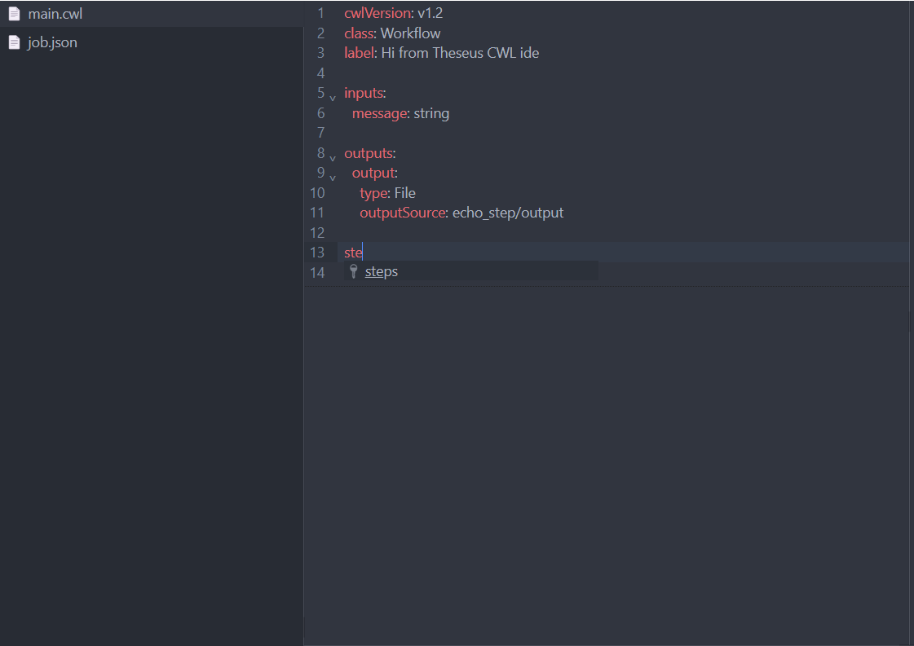

# @theseus-cwl/ui-react-editor

A React toolkit for displaying [CWL (Common Workflow Language)](https://www.commonwl.org/) source files.

[](https://www.npmjs.com/package/@theseus-cwl/ui-react-editor)

<div align="center">
  
</div>

## ✨ Features



- 📝 Edit CWL definitions in a structured code editor interface
- 📂 Flexible API: Supports JSON, YAML, or parsed objects
- Can be used as a standalone package

## 🚀 Installation

```bash
npm install @theseus-cwl/ui-react-editor
# or
yarn add @theseus-cwl/ui-react-editor
```

## 🛠 Example Usage

The editor component accepts CWL data in three forms:

- JSON object (parsed CWL, as in the example below)

- File

- String (raw JSON or YAML string)

```tsx
import { CwlSource } from "@theseus-cwl/types";
import { CwlCodeEditor } from "@theseus-cwl/ui-react-editor";

const Example = () => {
  const source: CwlSource = {
    entrypoint: "main",
    documents: [
      {
        name: "main",
        content: {
          cwlVersion: "v1.2",
          class: "Workflow",
          label: "Theseus CWL",
          inputs: {
            message: "string",
          },
          outputs: {
            output: {
              type: "File",
              outputSource: "echo_step/output",
            },
          },
          steps: {
            echo_step: {
              run: {
                class: "CommandLineTool",
                baseCommand: "echo",
                inputs: {
                  message: {
                    type: "string",
                    inputBinding: {
                      position: 1,
                    },
                  },
                },
                outputs: {
                  output: {
                    type: "File",
                    outputBinding: {
                      glob: "output.txt",
                    },
                  },
                },
                stdout: "output.txt",
              },
              in: {
                message: "message",
              },
              out: ["output"],
            },
          },
        },
      },
    ],
    parameters: [
      {
        name: "input",
        content: {
          message: "Hello from Theseus CWL !",
        },
      },
    ],
  };

  return <CwlCodeEditor input={source} />;
};
```

Theseus accepts valid CWL JSON/YAML objects and renders a code editor interface.

- [Common Workflow Language (CWL)](https://www.commonwl.org/)

## 📣 Contributing

We welcome contributions! If you’d like to improve Theseus or suggest new features.

## 📄 License

MIT License © 2026 [Davide Giorgiutti]
