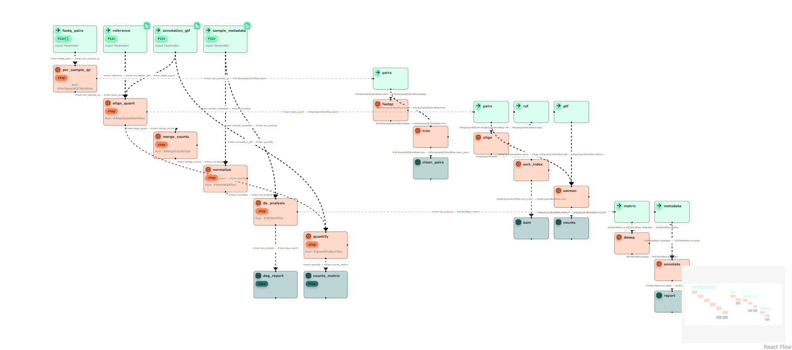

# @theseus-cwl/ui-react-viewer

A React toolkit for displaying [CWL (Common Workflow Language)](https://www.commonwl.org/) workflows as interactive DAG graphs.

[](https://www.npmjs.com/package/@theseus-cwl/ui-react-viewer)

<div align="center">
  
</div>

## ✨ Features

<div align="center">
  
</div>

- 🔍 Visualize CWL workflows as interactive graphs
- 📂 Flexible API: Supports JSON, YAML, or parsed objects
- Can be used as a standalone package

## 🚀 Installation

```bash
npm install @theseus-cwl/ui-react-viewer
# or
yarn add @theseus-cwl/ui-react-viewer
```

## 🛠 Example Usage

The CwlViewer component accepts CWL data in three forms:

- JSON object (parsed CWL, as in the example below)

- File

- String (raw JSON or YAML string)

```tsx
import { CwlSource } from "@theseus-cwl/types";
import { CwlViewer } from "@theseus-cwl/ui-react-viewer";

const Example = () => {
  const source: CwlSource = {
    entrypoint: "main",
    documents: [
      {
        name: "main",
        content: {
          cwlVersion: "v1.2",
          class: "Workflow",
          label: "Theseus CWL",
          inputs: {
            message: "string",
          },
          outputs: {
            output: {
              type: "File",
              outputSource: "echo_step/output",
            },
          },
          steps: {
            echo_step: {
              run: {
                class: "CommandLineTool",
                baseCommand: "echo",
                inputs: {
                  message: {
                    type: "string",
                    inputBinding: {
                      position: 1,
                    },
                  },
                },
                outputs: {
                  output: {
                    type: "File",
                    outputBinding: {
                      glob: "output.txt",
                    },
                  },
                },
                stdout: "output.txt",
              },
              in: {
                message: "message",
              },
              out: ["output"],
            },
          },
        },
      },
    ],
    inputs: [
      {
        name: "input",
        content: {
          message: "Hello from Theseus CWL !",
        },
      },
    ],
  };

  return (
    <CwlViewer input={source} minimap={true} wrappers={true} labels={true} />
  );
};
```

## 🛠 API

| Prop                       | Type                                                                                     | Default                                                     | Description                                                                                           |
| -------------------------- | ---------------------------------------------------------------------------------------- | ----------------------------------------------------------- | ----------------------------------------------------------------------------------------------------- |
| `input`                    | `CwlSource<Shape.Raw \| Shape.Sanitized>`                                                | `undefined`                                                 | CWL workflow source to visualize. Accepts parsed JSON/YAML objects representing a valid CWL workflow. |
| `onChange`                 | `(value: object) => void`                                                                | `console.log`                                               | Callback triggered when the workflow graph changes internally.                                        |
| `wrappers`                 | `boolean`                                                                                | `false`                                                     | Enables wrapper nodes in the graph view.                                                              |
| `minimap`                  | `boolean`                                                                                | `false`                                                     | Displays a minimap of the workflow graph.                                                             |
| `labels`                   | `boolean`                                                                                | `false`                                                     | Shows labels on graph edges.                                                                          |
| `colorEditor`              | `boolean`                                                                                | `false`                                                     | Enables the color editor panel for node types.                                                        |
| `initialColorState`        | `ColorState`                                                                             | `undefined`                                                 | Initial configuration for node colors.                                                                |
| `background`               | `Pick<BackgroundProps, "variant" \| "color" \| "bgColor" \| "style" \| "gap" \| "size">` | `{ color: "transparent", variant: BackgroundVariant.Dots }` | Configuration for the graph background.                                                               |
| `subWorkflowScalingFactor` | `number`                                                                                 | `0.8`                                                       | Scaling factor applied when rendering subworkflows.                                                   |

## 🎨 Styling

The viewer ships its own stylesheet and owns its whole look — the graph pane,
node cards, edges, the node inspector, and the color editor overlay.

The look can be customized through **CSS variables**, declared on the viewer's
root `.cwl-viewer` element:

### Viewer

| Variable          | Default   | Purpose           |
| ----------------- | --------- | ----------------- |
| `--cwl-viewer-bg` | `#fafafa` | Viewer background |

### Node cards

| Variable                                     | Default                             | Purpose                                  |
| -------------------------------------------- | ----------------------------------- | ---------------------------------------- |
| `--cwl-viewer-node-border-color`             | `#181a1faf`                         | Node card border                         |
| `--cwl-viewer-node-border-radius`            | `2px`                               | Node card corner radius                  |
| `--cwl-viewer-node-shadow`                   | `4px 4px 16px rgba(0, 0, 0, 0.171)` | Node card shadow                         |
| `--cwl-viewer-node-title-text-color`         | `#383a42`                           | Node card title                          |
| `--cwl-viewer-node-info-text-color`          | `#696c77`                           | Node card info line                      |
| `--cwl-viewer-node-icon-color`               | `#383a42`                           | Node card header icon                    |
| `--cwl-viewer-node-icon-bg`                  | `rgba(255, 255, 255, 0.356)`        | Node card header icon background         |
| `--cwl-viewer-node-icon-border-radius`       | `2px`                               | Node card header icon corner radius      |
| `--cwl-viewer-node-icon-shadow`              | `0 4px 6px rgba(0, 0, 0, 0.2)`      | Node card header icon shadow             |
| `--cwl-viewer-node-badge-bg`                 | `rgba(255, 255, 255, 0.356)`        | Node card badge background               |
| `--cwl-viewer-node-badge-text-color`         | `#383a42`                           | Node card badge text                     |
| `--cwl-viewer-node-badge-border-color`       | `rgba(0, 0, 0, 0.062)`              | Node card badge border                   |
| `--cwl-viewer-node-badge-shadow`             | `0 4px 6px rgba(0, 0, 0, 0.2)`      | Node card badge shadow                   |
| `--cwl-viewer-node-placeholder-text-color`   | `#383a42`                           | "+ New …" placeholder card text          |
| `--cwl-viewer-node-placeholder-border-color` | `#696c77`                           | "+ New …" placeholder card dashed border |
| `--cwl-viewer-wrapper-border-color`          | `#a0a1a7`                           | Dashed border of wrapper (group) nodes   |

### Edges

| Variable                             | Default                        | Purpose                   |
| ------------------------------------ | ------------------------------ | ------------------------- |
| `--cwl-viewer-edge-color`            | `#696c77`                      | Edge stroke and arrowhead |
| `--cwl-viewer-edge-label-bg`         | `#eaeaeb`                      | Edge label background     |
| `--cwl-viewer-edge-label-text-color` | `#383a42`                      | Edge label text           |
| `--cwl-viewer-edge-label-shadow`     | `0 1px 2px rgba(0, 0, 0, 0.5)` | Edge label shadow         |

### Node inspector

| Variable                        | Default                          | Purpose                    |
| ------------------------------- | -------------------------------- | -------------------------- |
| `--cwl-viewer-inspector-bg`     | `#f0f0f1`                        | Inspector panel background |
| `--cwl-viewer-inspector-shadow` | `-3px 0 8px rgba(0, 0, 0, 0.08)` | Inspector panel shadow     |

### Inspector forms

| Variable                                | Default                      | Purpose                     |
| --------------------------------------- | ---------------------------- | --------------------------- |
| `--cwl-viewer-form-header-text-color`   | `#383a42`                    | Form header text            |
| `--cwl-viewer-form-icon-color`          | `#383a42`                    | Form header icon            |
| `--cwl-viewer-form-icon-bg`             | `rgba(255, 255, 255, 0.356)` | Form header icon background |
| `--cwl-viewer-form-label-text-color`    | `#696c77`                    | Form field labels           |
| `--cwl-viewer-form-input-border-color`  | `#dbdbdc`                    | Form input borders          |
| `--cwl-viewer-form-button-border-color` | `#383a42`                    | Form button borders         |

### Color editor

| Variable                                              | Default       | Purpose                           |
| ----------------------------------------------------- | ------------- | --------------------------------- |
| `--cwl-viewer-color-editor-input-border-color`        | `transparent` | Color picker input borders        |
| `--cwl-viewer-color-editor-button-bg`                 | `#f0f0f1`     | Button background                 |
| `--cwl-viewer-color-editor-button-border-color`       | `transparent` | Button borders                    |
| `--cwl-viewer-color-editor-primary-button-bg`         | `#4078f2`     | Primary (Apply) button background |
| `--cwl-viewer-color-editor-primary-button-text-color` | `white`       | Primary (Apply) button text       |

Override them from your own CSS, on `.cwl-viewer` itself or any ancestor —
for example a dark theme matching the default One Dark look of
[`@theseus-cwl/ui-react-editor`](https://www.npmjs.com/package/@theseus-cwl/ui-react-editor):

```css
.my-app .cwl-viewer {
  --cwl-viewer-bg: #282c34;
  --cwl-viewer-node-title-text-color: #ffffff;
  --cwl-viewer-node-info-text-color: #abb2bf;
  --cwl-viewer-edge-color: #7d8799;
  --cwl-viewer-edge-label-bg: #21252b;
  --cwl-viewer-edge-label-text-color: #abb2bf;
  --cwl-viewer-inspector-bg: #21252b;
}
```

Note: the **fill colors** of input/step/output nodes are not CSS variables —
they are controlled at runtime via the `initialColorState` prop, the
`colorEditor` panel, or `configureTheseusCwl` from
`@theseus-cwl/configurations`.

## 📘 Learn More about CWL

- [Common Workflow Language (CWL)](https://www.commonwl.org/)

## 📣 Contributing

We welcome contributions! If you’d like to improve Theseus or suggest new features.

## 📄 License

MIT License © 2026 [Davide Giorgiutti]
